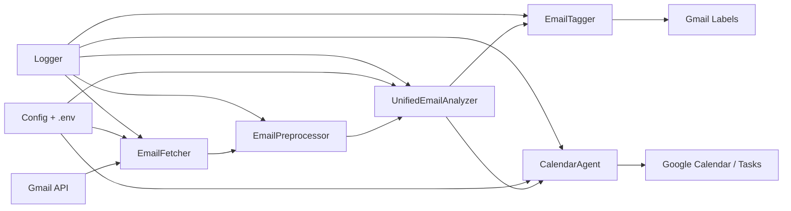

# Mail Agent Architecture

Last updated: 2026-02-06

## Overview
Mail Agent is a Python CLI that fetches unread Gmail messages, cleans the content, runs LLM-based analysis for spam/category/priority and action extraction, then tags emails and optionally creates Google Calendar events, reminders, or tasks. The system is intentionally lightweight: it uses Gmail labels to mark processed emails instead of a database and relies on Google APIs plus an OpenAI-compatible LLM client.

## High-Level Flow


## Runtime Entry Points
- CLI: `mail_agent/main.py` (`mail_agent` console script) orchestrates the full pipeline and supports multi-account processing.
- Manual test harness: `pipeline_tests_llm/test_fetch_preprocess_pipeline.py` exercises fetch, preprocess, analyze, and tagging.

## Core Components

### 1) Pipeline Orchestrator
- File: `mail_agent/main.py`
- Responsibilities:
  - Loads accounts from `accounts.json` (or CLI override).
  - Initializes Gmail + Calendar/Tasks services for each account.
  - Fetches unprocessed emails (last 24 hours).
  - Runs preprocessing, LLM analysis, tagging, and action execution.
  - Applies Gmail labels for categories and priority; adds a `ProcessedByAgent` label.
- Batch vs single:
  - Batch mode uses `process_batch` when `batch_size > 1`.
  - Single mode uses `process_email_pipeline` for detailed logging and tool execution.

### 2) Gmail Integration
- File: `email_fetcher/email_fetcher.py`
- Uses `GoogleServiceManager` to build Gmail API clients.
- Query: `after:<yesterday> -label:ProcessedByAgent` to skip processed emails.
- Standardizes email payloads into a dictionary with `from`, `subject`, `date`, `body`, and `thread_id`.

### 3) Google API Setup
- File: `email_fetcher/google_service_manager.py`
- Handles OAuth tokens in pickled files.
- Creates Gmail labels for priority and category when missing.
- Initializes Gmail, Calendar, and Tasks services per account.

### 4) Preprocessing
- File: `email_preprocessor/email_preprocessor.py`
- Decodes base64 body, strips HTML, removes URLs, signatures, disclaimers, and emojis.
- Normalizes whitespace for LLM input.

### 5) LLM Analysis
- File: `spam_detector/unified_email_analyzer.py`
- Uses OpenAI SDK with a configurable `base_url` to support OpenRouter, Groq, Ollama, and LM Studio.
- Enforces a strict JSON schema for email analysis results and tool extraction.
- Adds rate-limiting logic with token tracking and exponential backoff.

### 6) Tagging
- File: `email_tagger/email_tagger.py`
- Converts enum results to normalized Gmail labels:
  - `Priority/<Level>`
  - `Category/<Type>`

### 7) Calendar/Tasks Actions
- File: `calendar_agent/calendar_agent.py`
- Creates Google Calendar events and Google Tasks items based on analysis output.
- Converts timestamps into account timezone using `zoneinfo`.

### 8) Configuration and Logging
- Config: `mail_agent/config.py`
  - Defaults in code; `config.json` overrides.
  - Environment variable overrides are implemented but currently not enabled.
- Logging: `mail_agent/logger.py`
  - Console + rotating file handler at `logs/mail_agent.log`.

## Data Contracts

### Preprocessing Output
```json
{
  "cleaned_body": "...",
  "preprocessing_status": "success|error",
  "error_message": "..."
}
```

### LLM Analysis Output
```json
{
  "is_spam": "SPAM|NOT_SPAM",
  "category": "WORK|PERSONAL|FAMILY|SOCIAL|MARKETING|SCHOOL|NEWSLETTER|SHOPPING",
  "priority": "CRITICAL|URGENT|HIGH|NORMAL|LOW|IGNORE",
  "required_tools": ["calendar|reminder|task|none"],
  "calendar_event": {"title": "...", "start_time": "..."} | null,
  "reminder": {"title": "...", "due_date": "..."} | null,
  "task": {"title": "...", "due_date": "..."} | null,
  "reasoning": "..."
}
```

## State and Persistence
- Processed state is tracked via Gmail labels (no database).
- OAuth tokens are stored as pickled files per account.
- Logs are stored in `logs/`.

## Observations and Risks (Codebase Findings)
1) Batch mode label application likely fails.
   - In `run_pipeline`, `process_batch` receives `fetcher.label_ids` (account->labels mapping) but `process_batch` treats it as a flat label map. This will fail to locate `ProcessedByAgent` in batch mode.
2) Batch mode calendar actions may break.
   - `process_batch` passes `analysis['calendar_event']` directly to `CalendarAgent.create_event`, which expects a dict with `summary`, `start`, `end` keys, but the analyzer returns a Pydantic model (or its dict form). This mismatch can raise errors.
3) Duplicate `create_task` method in `calendar_agent/calendar_agent.py`.
   - The second definition shadows the first, which is harmless but confusing and error-prone.
4) `EmailPreprocessor.max_chars` is unused.
   - There is no truncation or summarization when emails exceed size constraints.
5) Gmail body extraction is shallow.
   - The fetcher only reads `text/plain` parts at the top level and does not walk multipart trees.

## Modernization Options: LangChain + LangGraph (Latest API)
If you want to align with current LangChain/LangGraph APIs, the pipeline can be expressed as a LangGraph `StateGraph` with nodes for fetch, preprocess, analyze, tag, and act. LangGraph’s API supports `StateGraph`, `add_node`, `add_edge`, and `compile(checkpointer=...)` with persistent memory/checkpointing. This fits well for multi-account runs and retryable workflows. citeturn5view0

For Gemini in LangChain, the recommended Python integration is `langchain-google-genai`, which now uses the consolidated `google-genai` SDK (as of `langchain-google-genai` 4.0.0) and supports both Gemini Developer API and Vertex AI. citeturn3view1

## LLM Backend Options (Gemini vs OpenAI-Compatible)
- OpenAI-compatible Gemini endpoint: Google states that Gemini models are accessible through the OpenAI library and REST API, initially supporting Chat Completions and Embeddings; examples use `base_url="https://generativelanguage.googleapis.com/v1beta/"`. citeturn7view3
- OpenAI Responses API (if you move to OpenAI): OpenAI’s `/v1/responses` is positioned as the modern, stateful API for agentic workflows and tool calling, while Chat Completions remains supported. citeturn9view2

## Suggested Migration Path (High-Level)
1) Extract LLM calls behind a backend interface (Gemini OpenAI-compatible, OpenAI, or LangChain).
2) Replace `UnifiedEmailAnalyzer` internals with:
   - LangChain `ChatGoogleGenerativeAI` for Gemini native usage (recommended if you want long-term Gemini support).
   - Or keep OpenAI SDK but allow base_url switches for Gemini/OpenRouter/Groq.
3) Convert the pipeline into a LangGraph graph to manage retries, memory, and structured state.

