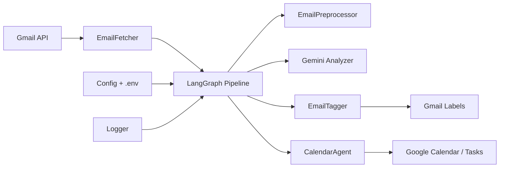

# Mail Agent Architecture

Last updated: 2026-02-06

## Overview
Mail Agent is a Python CLI that fetches unread Gmail messages, cleans the content, runs Gemini-based LLM analysis for spam/category/priority and action extraction, then tags emails and optionally creates Google Calendar events, reminders, or tasks. The system uses Gmail labels to mark processed emails instead of a database and relies on Google APIs plus LangGraph orchestration.

## High-Level Flow


## Runtime Entry Points
- CLI: `mail_agent/main.py` orchestrates account setup, fetches emails, and runs the LangGraph pipeline per email.
- Test harness: `pipeline_tests_llm/test_fetch_preprocess_pipeline.py` exercises fetch → preprocess → analyze → tag.

## Core Components

### 1) Pipeline Orchestrator (LangGraph)
- File: `mail_agent/graph.py`
- Graph nodes:
  - `preprocess`: cleans and normalizes email content
  - `analyze`: Gemini-based analysis with structured output
  - `decide_actions`: gates actions by priority and category
  - `execute_actions`: creates calendar events, reminders, and tasks
  - `apply_tags`: applies standardized Gmail labels
  - `mark_processed`: adds `ProcessedByAgent` label and tag labels

### 2) Gmail Integration
- File: `email_fetcher/email_fetcher.py`
- Fetches unprocessed emails from the last 24 hours.
- Uses Gmail label `ProcessedByAgent` to skip processed items.
- Recursively extracts `text/plain` or `text/html` parts.

### 3) Google API Setup
- File: `email_fetcher/google_service_manager.py`
- Handles OAuth tokens and initializes Gmail, Calendar, and Tasks services.
- Creates required Gmail labels if missing.

### 4) Preprocessing
- File: `email_preprocessor/email_preprocessor.py`
- Decodes base64 body, strips HTML, removes URLs, signatures, disclaimers, and emojis.
- Normalizes whitespace for LLM input.

### 5) LLM Analysis (Gemini)
- File: `spam_detector/unified_email_analyzer.py`
- Uses LangChain `ChatGoogleGenerativeAI` with Gemini Developer API.
- Enforces structured Pydantic output for analysis results.
- Best-effort retry logic for transient failures.

### 6) Tagging
- File: `email_tagger/email_tagger.py`
- Converts enum results to Gmail labels:
  - `Priority/<Level>`
  - `Category/<Type>`

### 7) Calendar/Tasks Actions
- File: `calendar_agent/calendar_agent.py`
- Creates Google Calendar events and Google Tasks items.
- Converts timestamps into account timezone using `zoneinfo`.

### 8) Configuration and Logging
- Config: `mail_agent/config.py`
  - Gemini model configuration, timezone, and batch size.
- Logging: `mail_agent/logger.py`
  - Console + rotating file handler at `logs/mail_agent.log`.

## Data Contracts

### Preprocessing Output
```json
{
  "cleaned_body": "...",
  "preprocessing_status": "success|error",
  "error_message": "..."
}
```

### LLM Analysis Output
```json
{
  "is_spam": "SPAM|NOT_SPAM",
  "category": "WORK|PERSONAL|FAMILY|SOCIAL|MARKETING|SCHOOL|NEWSLETTER|SHOPPING",
  "priority": "CRITICAL|URGENT|HIGH|NORMAL|LOW|IGNORE",
  "required_tools": ["calendar|reminder|task|none"],
  "calendar_event": {"title": "...", "start_time": "..."} | null,
  "reminder": {"title": "...", "due_date": "..."} | null,
  "task": {"title": "...", "due_date": "..."} | null,
  "reasoning": "..."
}
```

## State and Persistence
- Processed state is tracked via Gmail labels (no database).
- OAuth tokens are stored as pickled files per account.
- Logs are stored in `logs/`.

## Known Risks
- Gemini structured output may fail validation for rare inputs; graph nodes log errors and skip action execution.
- Gmail payloads vary; multipart parsing is best-effort and may still miss edge cases.
