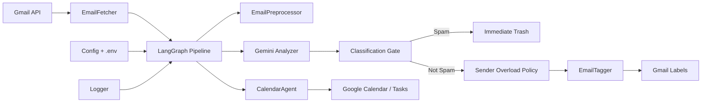

# Mail Agent Architecture

Last updated: 2026-03-02

## Overview
Mail Agent is a Python CLI that fetches unread Gmail messages, cleans the content, runs Gemini-based LLM analysis for spam/category/priority and action extraction, then tags emails and optionally creates Google Calendar events, reminders, or tasks. The system uses Gmail labels to mark processed emails instead of a database and relies on Google APIs plus LangGraph orchestration.

## High-Level Flow

```mermaid
flowchart LR
    A[Gmail API] --> B[EmailFetcher]
    B --> C[LangGraph Pipeline]
    C --> D[EmailPreprocessor]
    C --> E[Gemini Analyzer]
    E --> L[Classification Gate]
    L -->|Spam| M[Immediate Trash]
    L -->|Not Spam| N[Sender Overload Policy]
    N --> F[EmailTagger]
    C --> G[CalendarAgent]
    F --> H[Gmail Labels]
    G --> I[Google Calendar / Tasks]
    J[Config + .env] --> C
    K[Logger] --> C
```

## Runtime Entry Points
- CLI: `mail_agent/main.py` orchestrates account setup, fetches emails, and runs the LangGraph pipeline per email.
- Test harness: `pipeline_tests_llm/test_fetch_preprocess_pipeline.py` exercises fetch → preprocess → analyze → tag.

## Core Components

### 1) Pipeline Orchestrator (LangGraph)
- File: `mail_agent/graph.py`
- Graph nodes:
  - `preprocess`: cleans and normalizes email content
  - `analyze`: Gemini-based analysis with text-first structured output + multimodal fallback + deterministic heuristic fallback, plus sender unread context lookup
  - `validate_classification`: enforces complete classification contract (spam/category/priority)
  - `spam_disposition`: immediately trashes spam emails (configurable)
  - `apply_sender_overload_policy`: force `Priority/Ignore` for overloaded senders and clear tool actions
  - `decide_actions`: gates actions by priority and category
  - `execute_actions`: creates calendar events, reminders, and tasks
  - `apply_tags`: applies standardized Gmail labels
  - `mark_processed`: adds `ProcessedByAgent` only when required category and priority tags are both present and resolved; ignored mail is marked read and archived when configured

### 2) Gmail Integration
- File: `email_fetcher/email_fetcher.py`
- Fetches unprocessed emails from the last 24 hours.
- Uses Gmail label `ProcessedByAgent` to skip processed items.
- Uses Gmail pagination for message listing.
- Normalizes sender address into `sender_email`.
- Computes sender unread window stats per account (`get_sender_unread_window_stats`) with fail-open fallback.
- Recursively extracts `text/plain` or `text/html` parts and collects non-text attachment metadata (`attachment_id`, `filename`, `mime_type`, `size`, `inline_data_b64`).

### 3) Google API Setup
- File: `email_fetcher/google_service_manager.py`
- Handles OAuth tokens and initializes Gmail, Calendar, and Tasks services.
- Creates required Gmail labels if missing.

### 4) Preprocessing
- File: `email_preprocessor/email_preprocessor.py`
- Decodes base64 body, strips HTML with line-preserving extraction, removes quoted reply chains, signatures/disclaimers, and emojis.
- Replaces URLs with `[URL]` placeholders to preserve link signal.
- Normalizes whitespace for LLM input without flattening all line boundaries.
- Produces `text_length` and `body_quality` (`full_text`, `short_text`, `no_text`) for classifier fallback routing.
- Produces extraction metadata fields: `extraction_source` and `has_reply_chain`.

### 5) LLM Analysis (Gemini)
- File: `spam_detector/unified_email_analyzer.py`
- Uses LangChain `ChatGoogleGenerativeAI` with Gemini Developer API.
- Enforces structured Pydantic output for analysis results.
- Uses staged fallback: text structured analysis, multimodal structured analysis (attachments), then deterministic heuristic fallback.
- Guarantees classification metadata fields: `classification_source` and `classification_complete`.
- Includes sender context in prompts (`Sender Email`, sender unread count, sender overload flag).

### 6) Tagging
- File: `email_tagger/email_tagger.py`
- Converts enum results to Gmail labels:
  - `Priority/<Level>`
  - `Category/<Type>`

### 7) Calendar/Tasks Actions
- File: `calendar_agent/calendar_agent.py`
- Creates Google Calendar events and Google Tasks items.
- Converts timestamps into account timezone using `zoneinfo`.

### 8) Configuration and Logging
- Config: `mail_agent/config.py`
  - Gemini model configuration, timezone, batch size, sender-overload controls, ignore disposition, and ignore retention.
- Logging: `mail_agent/logger.py`
  - Console + rotating file handler at `logs/mail_agent.log`.

## Data Contracts

### Preprocessing Output
```json
{
  "cleaned_body": "...",
  "text_length": 1234,
  "body_quality": "full_text|short_text|no_text",
  "extraction_source": "text_plain|text_html|mixed|none",
  "has_reply_chain": false,
  "preprocessing_status": "success|error",
  "error_message": "..."
}
```

### LLM Analysis Output
```json
{
  "is_spam": "SPAM|NOT_SPAM",
  "category": "WORK|PERSONAL|FAMILY|SOCIAL|MARKETING|SCHOOL|NEWSLETTER|SHOPPING",
  "priority": "CRITICAL|URGENT|HIGH|NORMAL|LOW|IGNORE",
  "priority_original": "HIGH",
  "priority_overridden_by_policy": true,
  "priority_override_reason": "sender_overload_12_in_30d",
  "classification_source": "llm_text|llm_multimodal|heuristic",
  "classification_complete": true,
  "required_tools": ["calendar|reminder|task|none"],
  "calendar_event": {"title": "...", "start_time": "..."} | null,
  "reminder": {"title": "...", "due_date": "..."} | null,
  "task": {"title": "...", "due_date": "..."} | null,
  "reasoning": "..."
}
```

## State and Persistence
- Processed state is tracked via Gmail labels (no database).
- Ignored mail can be archived and marked read at processing time (`removeLabelIds=["UNREAD","INBOX"]`).
- Cleanup applies ignore-retention grace (`ignore_cleanup_days`, default 7) before deleting ignored mail.
- OAuth tokens are stored as pickled files per account.
- Logs are stored in `logs/`.

## Known Risks
- Gemini structured output may fail validation for rare inputs; analyzer now falls back to deterministic heuristics to keep classification complete.
- Gmail payloads vary; multipart parsing is best-effort and may still miss edge cases.

## Hybrid trigger architecture

The runtime model now combines two entry paths into the same processing graph:
- Scheduled fallback: the hourly `mail-agent-job` continues to fetch messages from the last 24 hours that do not already have `ProcessedByAgent`.
- Push-triggered execution: Gmail `users.watch` notifications hit `mail_agent.trigger_service`, which debounces by account with Cloud Tasks and then launches the same Cloud Run Job with `MAIL_AGENT_TARGET_ACCOUNT_ID` set.

### Trigger flow

1. Gmail sends a Pub/Sub notification for a watched mailbox.
2. Pub/Sub pushes to `POST /pubsub/gmail` on the trigger service.
3. The trigger service maps `emailAddress` to an account config entry and enqueues one delayed Cloud Task for that account and debounce window.
4. `POST /internal/execute/{account_id}` checks Cloud Run executions for an active or too-recent account run.
5. If the execution gap is clear, the service launches `mail-agent-job` with `MAIL_AGENT_TARGET_ACCOUNT_ID` so only that mailbox is processed.

### Analysis pipeline constraints

The analyzer remains a strict multi-stage pipeline:
- classification-only pass first
- repair pass only for incomplete classification outputs
- tool extraction only after complete non-spam classification
- heuristic fallback as the final guarantee

This preserves `classification_source`, `classification_complete`, spam branching, and processed-label invariants while allowing near-real-time trigger entry.

### Trigger endpoint protection

`/pubsub/gmail` remains externally reachable for Pub/Sub push delivery. `/internal/execute/{account_id}` is treated as an internal path and requires `MAIL_AGENT_TRIGGER_SHARED_SECRET`, forwarded by Cloud Tasks in an internal header.
